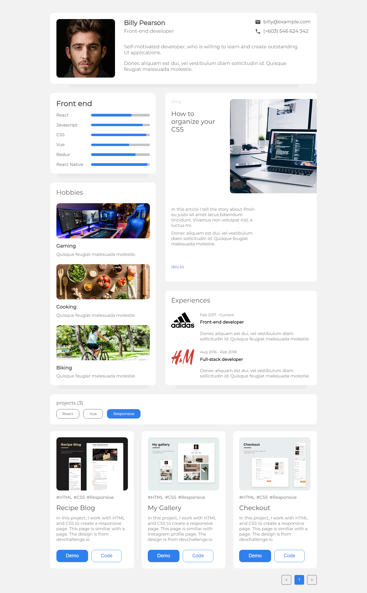

<!-- Please update value in the {}  -->

<h1 align="center">Portofolio Master</h1>

   Solution for a challenge from  <a href="http://devchallenges.io" target="_blank">Devchallenges.io</a>.

  <h3>
    <a href="https://onlymanu-portofolio.netlify.app/">
      Demo
    </a>
     | 
    <a href="https://github.com/OnlyManu/portofolio-master">
      Solution
    </a>
     | 
    <a href="https://devchallenges.io/challenges/5ZnOYsSXM24JWnCsNFlt">
      Challenge
    </a>
  </h3>

<!-- TABLE OF CONTENTS -->

## Table of Contents

- [Overview](#overview)
  - [Built With](#built-with)
- [Features](#features)
- [How to use](#how-to-use)
- [Contact](#contact)

<!-- OVERVIEW -->

## Overview

This is a fake portofolio page build for a devchallenges project

### Built With

<!-- This section should list any major frameworks that you built your project using. Here are a few examples.-->

- [React](https://reactjs.org/)
- HTML
- CSS

## Features

<!-- List the features of your application or follow the template. Don't share the figma file here :) -->

This application/site was created as a submission to a [DevChallenges](https://devchallenges.io/challenges) challenge. The [challenge](https://devchallenges.io/challenges/5ZnOYsSXM24JWnCsNFlt) was to build an application to complete the given user stories.

- User story: I can see personal details
- User story: I can see skills
- User story: I can see projects
- User story: I can filter projects by tag
- User story: I can see hobbies or certificates
- User story (optional): I can see experiences
- User story (optional): I can see blogs
- User story (optional): I can see projects on different pages

## Contact

- GitHub [@OnlyManu](https://github.com/OnlyManu)

